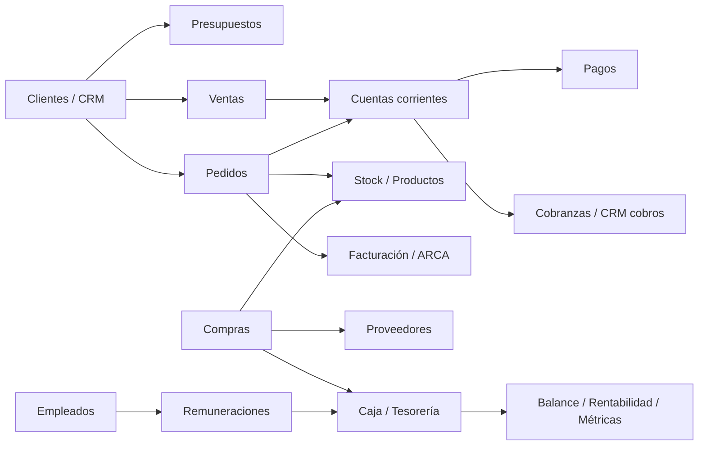
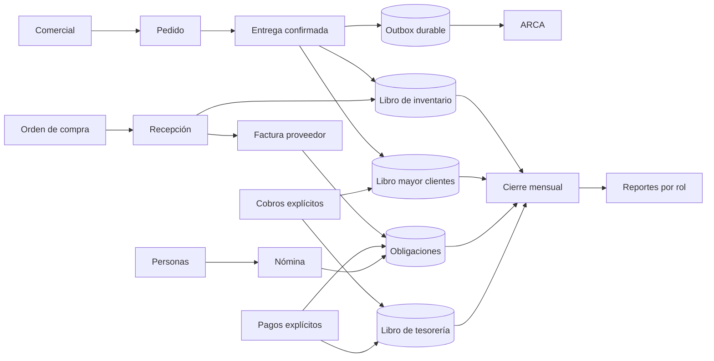

# Auditoría integral y rediseño de Starlim

**Fecha de corte:** 6 de octubre de 2026
**Alcance:** código fuente local, modelo de datos expresado por migraciones, navegación, permisos, integraciones y prototipo `/system-v2`.
**Fuera de alcance en esta etapa:** escrituras en producción, pruebas contra ARCA real, Mercado Pago real o la base productiva.

## 1. Dictamen ejecutivo

Starlim tiene una base técnica valiosa: separación por empresa, transacciones de base de datos, trazabilidad en varios dominios, autorización fiscal con reconciliación y un conocimiento del negocio muy superior al de un sistema genérico. El problema no es la ausencia de funciones. El problema es que el crecimiento ocurrió por capas y hoy conviven rutas, reglas y modelos distintos para una misma operación.

El sistema actual no debe tratarse como un prototipo descartable ni como un obstáculo. Es el registro vivo de cómo trabaja Starlim: contiene decisiones, excepciones, vocabulario y aprendizajes operativos construidos durante años. Su apariencia brusca y algunos recorridos extensos no invalidan ese conocimiento. La V2 debe **evolucionarlo**, conservando sus capacidades reales y reorganizándolas alrededor de recorridos más simples y reglas consistentes.

La recomendación es **NO-GO para un reemplazo total de una sola vez** y **GO para una evolución menú por menú**, empezando por las áreas de uso nulo o bajo y protegiendo los dos circuitos que Starlim utiliza de manera continua: Operaciones y Cobros/Pagos.

La V2 debe conservar el motor transaccional, los documentos, las reglas comerciales útiles y el conocimiento acumulado, pero imponer cinco reglas no negociables:

1. una sola fuente de verdad por entidad y por saldo;
2. movimientos económicos inmutables, corregidos por reversión y no por borrado;
3. imputaciones explícitas para cobros y pagos;
4. efectos derivados idempotentes mediante eventos durables;
5. cierre mensual reproducible y conciliable.

## 2. Línea de base cuantitativa

| Indicador | Resultado observado |
| --- | ---: |
| Pantallas `page.tsx` | 77 |
| Endpoints `route.ts` | 124 |
| Módulos en `src/lib` | 129 |
| Archivos de pruebas | 69 |
| Pruebas basadas principalmente en inspección de texto | 46 |
| Migraciones en `migrations/` | 53 |
| Migraciones en `supabase/migrations/` | 43 |
| Resultado de `npm test` | 9 fallos |
| Lint | Correcto |
| TypeScript | Correcto |
| Escaneo de seguridad local | Correcto |
| Verificación de entorno local | Incompleta: faltan credenciales y secretos |

La cantidad de pantallas y endpoints no es un problema por sí misma. Sí lo es que existan varios recorridos para clientes, presupuestos, cobranzas, ventas, precios, tesorería, rentabilidad y personal, con reglas parcialmente diferentes.

## 3. Fortalezas que deben conservarse

- **Contexto por empresa y transacciones.** `src/lib/db.ts` establece contexto de empresa dentro de la transacción y permite aislamiento por RLS.
- **Bloqueos e idempotencia en operaciones sensibles.** La entrega de pedidos valida stock, genera movimientos y evita débitos duplicados.
- **Reconciliación fiscal defensiva.** El motor fiscal contempla que ARCA haya aprobado un comprobante aunque falle la persistencia local.
- **Conocimiento operativo real.** El código modela remitos, facturas, notas de crédito, reservas de stock, cuentas corrientes y documentos argentinos.
- **Prototipo V2 desacoplado.** `/system-v2` usa datos ficticios y permite probar la organización futura sin tocar producción.

## 3.1. Principio de evolución

Cada funcionalidad actual debe pasar por cuatro preguntas antes de decidir su destino:

1. ¿Qué problema real de Starlim resuelve hoy?
2. ¿Qué regla de negocio o excepción aprendida contiene?
3. ¿Qué parte genera fricción por la interfaz y cuál por la lógica?
4. ¿Puede conservarse el núcleo y cambiar solamente su presentación o integración?

Por defecto se debe **conservar y adaptar**. Sólo se reemplaza una capacidad cuando exista evidencia de duplicación, contradicción, riesgo contable, inseguridad o imposibilidad de mantenerla. Incluso cuando una pantalla se retire, sus reglas válidas deben migrarse y quedar cubiertas por pruebas.

## 3.2. Uso real y estrategia por menú

La criticidad no coincide con el tamaño técnico del módulo. El orden debe responder al uso real:

| Menú | Uso actual | Estrategia |
| --- | --- | --- |
| Operaciones | Alto y diario | Proteger. Evolucionar sobre el circuito actual, sin reemplazo brusco |
| Cobros y pagos | Alto y diario | Proteger. Corregir inconsistencias puntuales y preparar migración paralela |
| Datos: clientes, precios y stock | Medio | Rediseñar con migración íntegra de datos y compatibilidad temporal |
| Compras | Bajo; funcionamiento insatisfactorio | Reemplazar por un circuito nuevo, manteniendo consulta histórica |
| Administración y Finanzas | Nulo | Primer bloque candidato a sustitución completa |
| RR.HH. | Muy bajo; principalmente usuarios y permisos | Rediseñar, preservando autenticación, ingreso y salida del sistema |
| CRM | Cercano a nulo | Reemplazar o integrar dentro de Comercial sin doble navegación |

Esto permite evolucionar el sistema sin poner en riesgo la operación diaria. Los menús nuevos pueden entrar en producción por separado; la unificación estética se realiza al final, cuando la arquitectura funcional ya esté estabilizada.

## 4. Hallazgos priorizados

### P0 — Cobranzas con dos reglas incompatibles

El flujo nuevo admite imputaciones y saldo a favor (`src/lib/customer-accounts.ts:577`, `:601`, `:685`), mientras el flujo anterior impide superar el saldo (`src/lib/collections.ts:77`, `:361`, `:421`). Además, la interfaz promete aplicar el cobro únicamente a los remitos elegidos, pero una selección vacía se transforma en `undefined` (`src/lib/customer-accounts.ts:784`) y activa la asignación FIFO del backend.

**Riesgo:** el mismo cobro produce resultados distintos según la pantalla; puede aparecer saldo a favor, pago flotante o imputación silenciosa.
**Decisión:** unificar todo ingreso por cobranza en un único servicio de dominio. La ausencia de imputaciones debe significar “crédito general”, nunca “FIFO implícito”. FIFO sólo puede existir como acción explícita y visible.

### P0 — Borrado físico de hechos económicos

`deletePurchase` (`src/lib/purchases.ts:536`) y `deleteSale` (`src/lib/sales-admin.ts:467`) eliminan movimientos, pagos, documentos y stock relacionados. Existen también eliminaciones directas en cuentas.

**Riesgo:** imposibilidad de reconstruir saldos históricos, pérdida de cadena de auditoría y correcciones difíciles de defender ante clientes o contador.
**Decisión:** reemplazar por estados `anulado/revertido`, asientos inversos y motivo obligatorio. El borrado físico queda limitado a borradores sin efectos.

### P0 — Permisos globales demasiado amplios

`isFullAccessRole` (`src/lib/route-auth.ts:257`) trata Administrador y Jefe como acceso total. `filterPermissionKeysForActor` (`src/lib/employees.ts:166`) permite que ambos roles operen sobre el catálogo completo de permisos. Esto contradice documentación previa que pretendía restringir facultades sensibles.

**Riesgo:** acceso económico o administrativo no deseado y una interfaz que oculta menos de lo que protege.
**Decisión:** autorización por capacidad y alcance, sin atajos por rol. Los roles pasan a ser plantillas de permisos; cada endpoint debe verificar capacidades concretas.

### P0 — Migraciones sin una única fuente canónica

Conviven `migrations/`, `supabase/migrations/` y `supabase_migration.sql`. Hay migraciones casi duplicadas para clientes de presupuestos y documentación contradictoria sobre cuál carpeta manda.

**Riesgo:** entornos con esquemas diferentes, despliegues imposibles de reproducir y correcciones que funcionan sólo en una base.
**Decisión:** declarar `supabase/migrations/` como secuencia canónica, consolidar el estado inicial, registrar `schema_migrations` y probar upgrade desde copia anonimizada antes de cada promoción.

### P1 — Compra, recepción, factura y pago mezclados

La compra actual puede actualizar el proveedor único del producto (`src/lib/purchases.ts:432`), marcar recepción, mover stock y actualizar costo dentro del mismo alta. El pago a proveedor limita el importe con `Math.min` (`src/lib/purchases.ts:831`) y puede crear la obligación recién al pagar.

**Riesgo:** stock, deuda y factura dejan de representar momentos diferentes; no se modelan anticipos ni ofertas alternativas.
**Decisión:** separar Orden de compra → Recepción → Factura de proveedor → Obligación → Aplicación de pago. Producto–proveedor debe ser muchos a muchos.

### P1 — Entrega confirmada antes de terminar la emisión fiscal

La entrega se confirma en una transacción y luego se intenta autorizar el comprobante (`src/lib/orders.ts:1506-1519`). La separación es razonable para no retener una transacción durante una llamada externa, pero hoy falta una cola durable que garantice reintentos y observabilidad.

**Riesgo:** pedidos entregados con factura pendiente indefinidamente.
**Decisión:** mantener el límite transaccional y crear un `outbox_event` idempotente con reintento, estado, última causa y alerta operacional.

### P1 — RR.HH. combina identidad, acceso y relación laboral

La cuenta de Supabase Auth se crea antes de confirmar la transacción del empleado (`src/lib/employees.ts:97`, `:299`). Si la escritura local falla, puede quedar un usuario huérfano. La automatización de asistencia fija empresa y persona en código (`src/lib/attendance-automation.ts:4-5`).

**Riesgo:** identidades desincronizadas y automatizaciones imposibles de escalar.
**Decisión:** separar legajo, identidad de acceso, horario, asistencia y remuneración. La creación debe ser un flujo compensable y la agenda debe provenir de datos configurables.

### P1 — IA sin garantía de respuesta final

El agente limita la ejecución con `stepCountIs(3)` (`src/lib/supervisor-lab/agent.ts:21`). La interfaz ya contempla el estado “terminó sin redactar” (`src/app/supervisor-lab/supervisor-chat.tsx:323`), que es exactamente la falla observada.

**Riesgo:** el sistema obtiene datos pero no entrega una conclusión al usuario.
**Decisión:** síntesis final determinística desde la última salida de herramienta, fallback de modelo, identificador de solicitud visible y prueba contractual de “siempre existe respuesta final”.

### P1 — Portal y tienda fijados a una empresa

Hay `COMPANY_ID = 1` en portal, tienda, pagos y métricas públicas. Es aceptable para una instalación única, pero contradice el aislamiento multiempresa del núcleo.

**Decisión:** resolver empresa por dominio/configuración firmada y rechazar cualquier acceso que no tenga contexto explícito.

### P2 — Catálogos y pantallas con deuda de experiencia

La base de proveedores soporta más acciones que la interfaz; faltan CUIT, razón social robusta, múltiples contactos, cuentas bancarias y relación producto–proveedor. La tabla actual también presenta encabezados y celdas desalineados.

**Decisión:** ficha maestra de proveedor con historial, ofertas, documentos y rendimiento; edición contextual en lugar de nuevas pestañas.

## 5. Mapa actual simplificado

El diagrama muestra la causa de la fricción: no hay un único recorrido canónico entre una decisión y sus efectos.

## 6. Mapa futuro

## 7. Regla de fuente de verdad

| Concepto | Fuente propuesta | No debe calcularse desde |
| --- | --- | --- |
| Saldo de cliente | libro mayor + aplicaciones | estado visual del remito |
| Saldo de proveedor | obligaciones + aplicaciones | suma improvisada de compras |
| Stock | movimientos por depósito/lote | campo editable aislado |
| Caja y bancos | movimientos de tesorería conciliados | cobros o pagos sin cuenta destino |
| Estado fiscal | documento fiscal + respuesta ARCA | estado del pedido solamente |
| Rentabilidad | cierre mensual versionado | consulta cambiante del día |
| Permiso | capacidad explícita y alcance | nombre del rol |

## 8. Experiencia objetivo

El usuario no debería decidir qué tablas modificar. Debe confirmar una acción de negocio y ver, antes de ejecutarla, sus efectos:

- **Entregar pedido:** baja stock, crea deuda y programa factura si corresponde.
- **Registrar cobro:** muestra documentos seleccionados, crédito general y cuenta de ingreso.
- **Recibir compra:** aumenta stock, pero no inventa una factura.
- **Registrar factura del proveedor:** crea obligación y vencimiento.
- **Pagar:** aplica sólo a obligaciones elegidas; el excedente es anticipo visible.
- **Corregir:** anula o revierte, nunca borra historia.

## 9. Qué puede afirmarse hoy

- El prototipo permite recorrer de manera local los dominios principales con datos ficticios.
- El código compila, pasa lint y el escaneo local de seguridad.
- No puede afirmarse todavía que todos los flujos productivos funcionen punta a punta: faltan credenciales locales, base de prueba equivalente a producción y pruebas reales de mutación.
- La cobertura actual detecta regresiones textuales, pero no garantiza comportamiento integrado.

## 10. Recomendación final

Avanzar con la V2 como una **evolución por sustitución de menús**, no como reescritura total. El sistema actual es la referencia funcional y el banco de reglas desde el cual se migra. El primer reemplazo debe ser Administración y Finanzas; después Compras; luego RR.HH. y CRM/Datos según dependencia. Operaciones y Cobros/Pagos se mantienen activos hasta el final y se mejoran primero de manera localizada. La unificación estética queda como etapa posterior a la estabilización funcional.

La decisión de producción sólo puede cambiar a GO cuando:

- no haya diferencias de saldos en dos cierres consecutivos;
- cobros, pagos, stock y fiscalidad sean idempotentes;
- los P0 estén cerrados con pruebas de integración;
- exista rollback ensayado;
- los usuarios de cada rol completen sus recorridos sin usar rutas antiguas.
