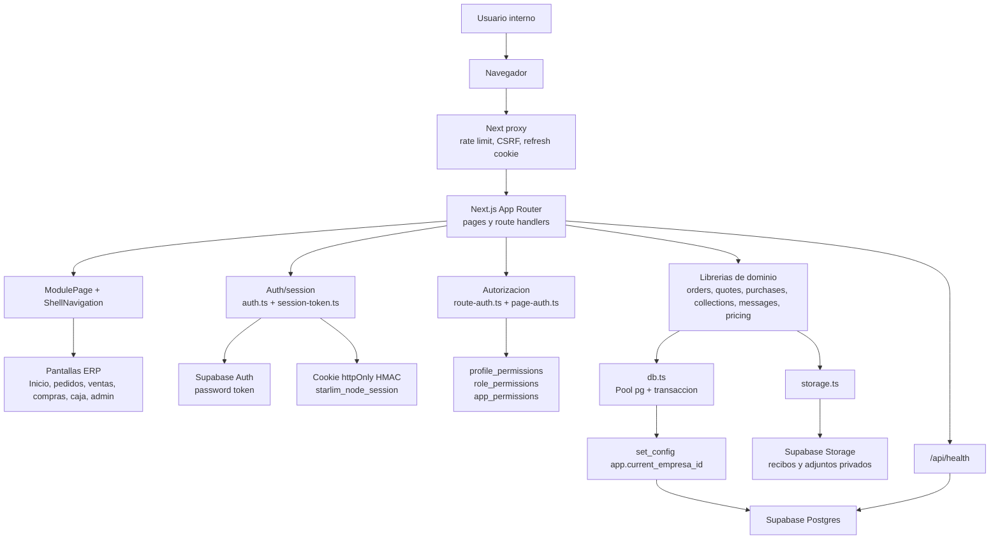
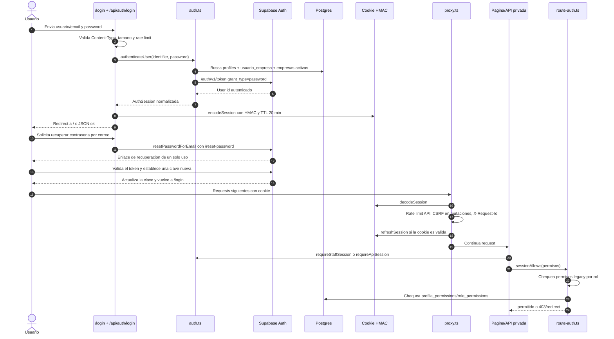
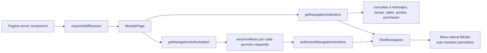
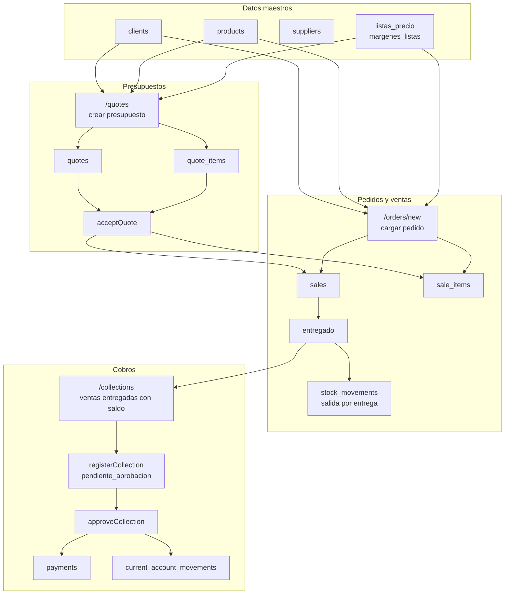
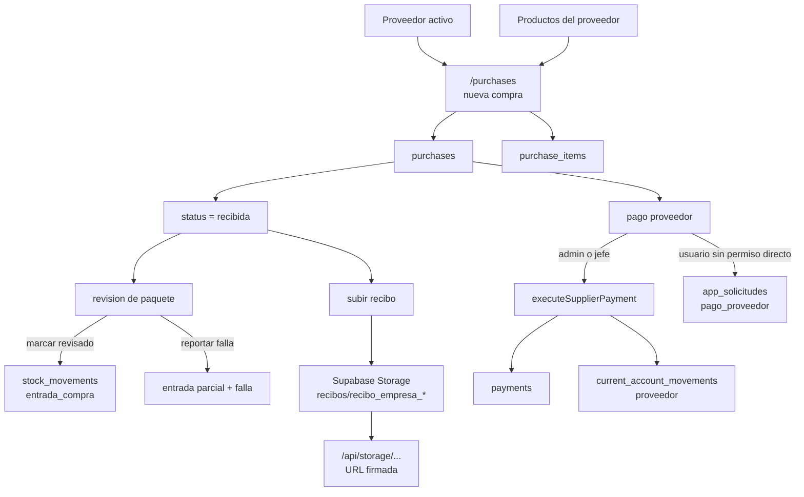
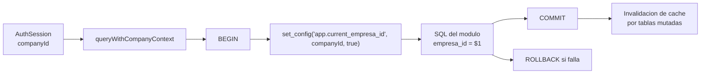
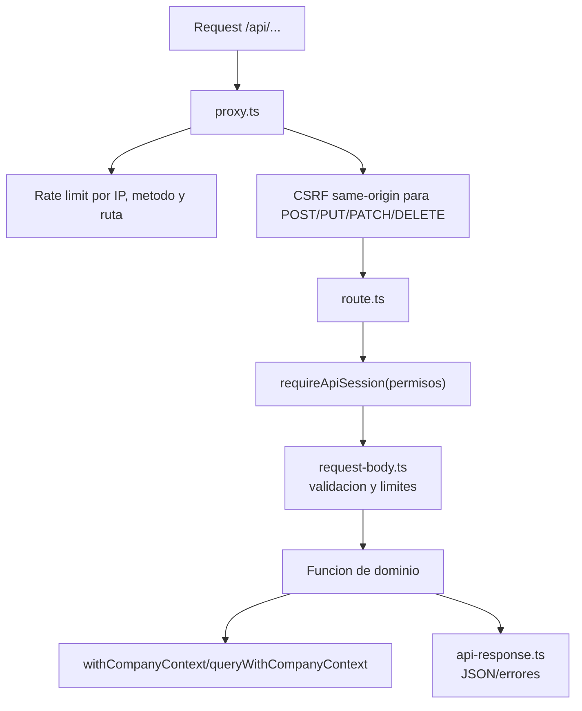
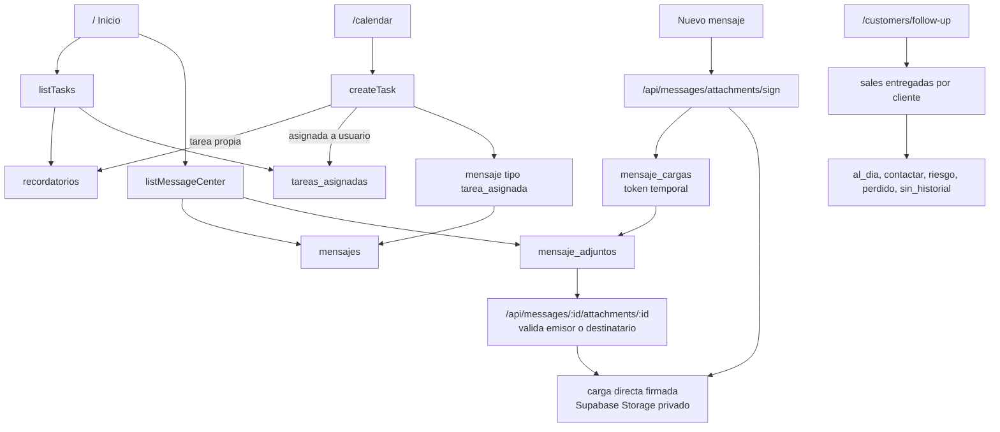

# Diagrama de flujos del proyecto Star_lim

Este documento resume el flujo tecnico y operativo observado en el repo actual.
La app principal vive en `apps/web` y usa Next.js App Router con APIs server-side,
Postgres/Supabase como base operativa y Supabase Auth/Storage como servicios
externos controlados desde el servidor.

## 1. Arquitectura general

## 2. Flujo de autenticacion y autorizacion

El flujo requiere que Supabase Auth tenga autorizadas las URLs
`https://starlim.vercel.app/reset-password` y
`http://localhost:3000/reset-password`. La respuesta de solicitud es siempre
generica para no revelar si un correo pertenece a una cuenta.

## 3. Flujo de shell, menu e indicadores

Los grupos principales del menu salen de `apps/web/src/lib/navigation.ts`:

- Inicio: escritorio, calendario, mensajes.
- Operaciones: pedidos, ventas, presupuestos, fiscal.
- Datos: precios, clientes, seguimiento, proveedores, stock.
- Compras: nueva compra, recompra MRP, registro.
- Administracion: empleados, metricas, rentabilidad, aprobaciones.
- Finanzas: balance, sueldos/dividendos, caja, cash flow, cuentas por pagar.
- Cobros y pagos: cobros, cuentas corrientes, pagos proveedores.

## 4. Flujo operativo comercial

El flujo visible de Pedidos permite `cargado -> entregado` en un solo paso. La entrega valida el stock físico disponible menos las reservas de otros pedidos confirmados, registra la salida y habilita el cobro dentro de la misma transacción. Los pedidos `confirmado` existentes siguen pudiendo entregarse o cancelarse por compatibilidad.

Estados principales:

- Pedido nuevo: crea `sales` y `sale_items` con `order_status = cargado`.
- Entrega: mueve de `cargado` o `confirmado` a `entregado`, descuenta stock con validacion y habilita cobro.
- Cobro registrado: queda en `pendiente_aprobacion`.
- Cobro aprobado: inserta `payments`, impacta `current_account_movements` y deja el saldo como `recibido` o `pendiente`.

## 5. Flujo operativo de compras, stock y pagos proveedor

Reglas relevantes:

- La compra valida proveedor activo, productos activos y correspondencia producto-proveedor.
- El stock entra cuando la compra recibida se revisa, no al crear la compra.
- El pago a proveedor puede ir directo para roles altos o quedar como solicitud de aprobacion.
- Los recibos se suben con service role desde servidor y se sirven mediante ruta firmada.

## 6. Flujo de datos multiempresa

El aislamiento de empresa se apoya en dos capas:

- La sesion trae `companyId` desde `usuario_empresa` y `empresas`.
- Las consultas pasan por `queryWithCompanyContext` o `withCompanyContext`, fijando `app.current_empresa_id` dentro de una transaccion y usando filtros `empresa_id`.

## 7. Flujo de APIs privadas

Excepciones intencionales observadas:

- `/api/auth/login`: entrada publica con rate limit propio.
- `/api/auth/password-recovery`: solicita un enlace sin revelar si el correo existe.
- `/api/auth/me`: lee sesion actual.
- `/api/health`: health check de runtime y DB.
- `/api/auth/logout`: publica para cerrar cookie.

## 8. Flujo de soporte interno: mensajes, tareas y seguimiento

## 9. Puntos de control del sistema

- Seguridad de entrada: proxy con rate limit, CSRF para mutaciones y cookie httpOnly firmada.
- Seguridad de negocio: permisos por rol legacy mas permisos DB por perfil/rol.
- Seguridad de datos: contexto multiempresa, filtros `empresa_id`, transacciones y locks en secuencias criticas.
- Integridad comercial: presupuestos se convierten atomica y trazablemente en pedidos.
- Integridad de stock: entrega de pedidos descuenta stock; revision de compras suma stock.
- Integridad financiera: cobros/pagos impactan `payments` y `current_account_movements`.
- Operacion diaria: inicio, mensajes, tareas e indicadores salen de las mismas tablas operativas.
- Adjuntos internos: la carga evita el limite de las funciones de Vercel mediante URLs firmadas, y la descarga exige pertenecer al mensaje antes de emitir una URL temporal.
